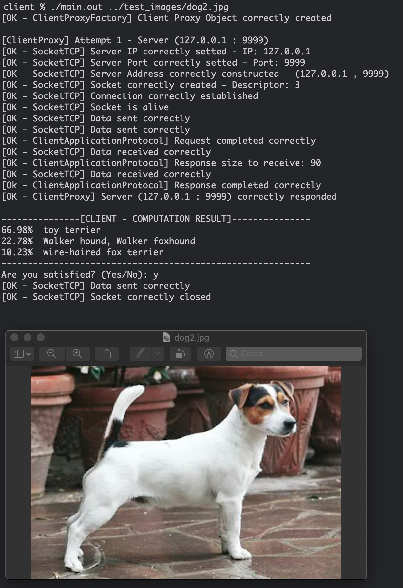
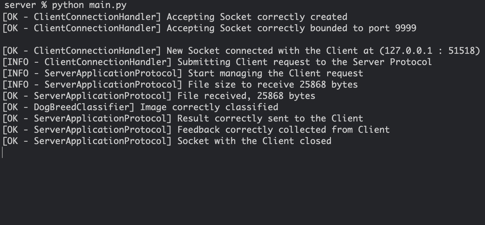

# Dog Breed Classification

“Client/Server desktop application that allows client to make requests to the server, where each request contains the image of a dog. The Server, through appropriate methodologies of Deep Learning, will identify the breed of the dog present in the photo, and in the case in which the animal is an "half-breed", it will try to reconstruct which are the breeds that most contributed to its family tree”




## Run

Server:

```sh
cd server
python3 -m pip install -r requirements.txt

python3 main.py
```

Client:

```sh
cd client
make

./main.out ../test_images/dog1.jpg
```
